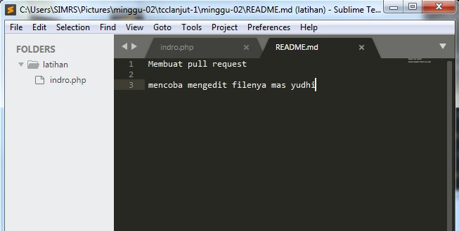
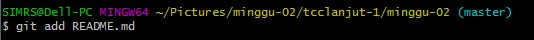
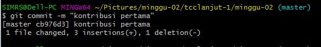
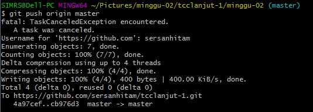
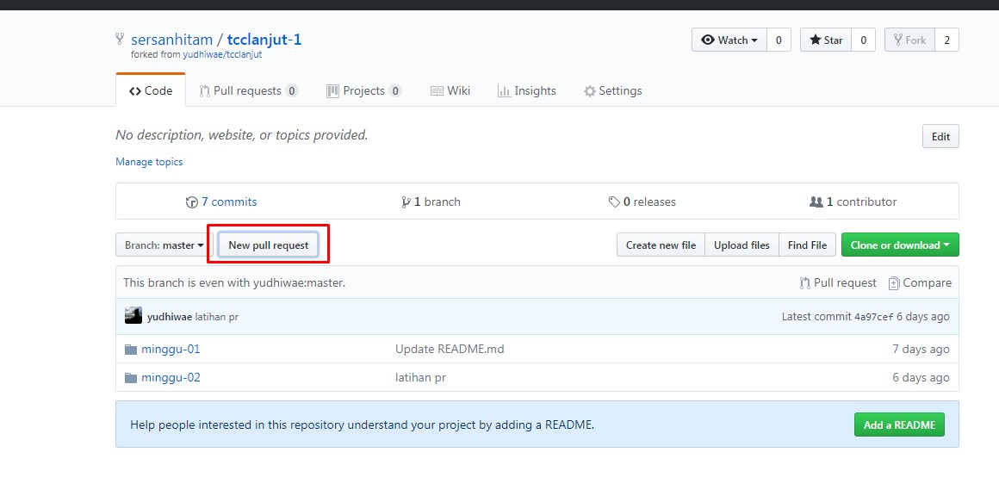
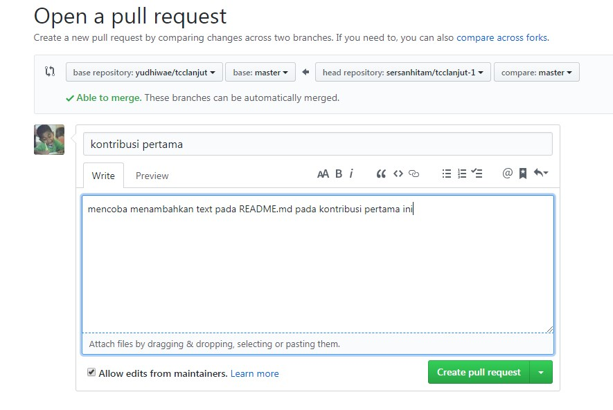
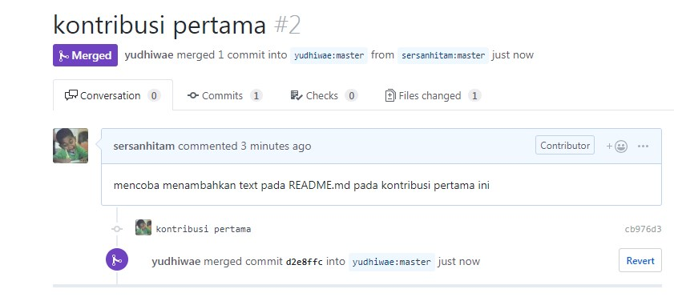

## Kolaborasi pada Git

1. **Fork** adalah membuat clone dari suatu repo di GitHub milik upstream author **(pemilik repo)**, guna memproses ke komputer lokal kontributor.
  

2. Kontributor harus mem-fork repo upstream author (pemilik repo) sehingga di repo kontributor muncul repo tersebut
  

3. Selanjutnya silahkan clone (download) repository tersebut ke komputer lokal

  

4. Setelah melakukan clone ke komputer lokal, selanjutnya silahkan buka dengan teks editor dan lakukan modifikasi pada salah satu file yang akan di modifikasi. 

  

5. Setiap kali melakukan perubahan, kirim perubahan tersebut. Pengiriman ini disebut dengan Pull Request.

	* Kontributor akan bekerja di repo lokal (create, update, delete isi)
	* Commit 
	* Push ke repo kontributor
	* Kirimkan PR ke repo upstream author(pemilik repo)
   
6. Setelah kita selesai melakukan perubahan dan commit, langkah berikutnya adalah melakukan push

   

   

   

7. Pull Request adalah istilah yang bisa kita artikan sebagai permintaan untuk menggabungkan kode
Kita sudah membuat perubahan di repository hasil fork, lalu ingin menggabungkan dengan repository sumber.
Maka kita harus membuat Pull Request

   

8. Silahkan isi judul Pull Request dan pesan yang ingin disampaikan

   

9. Setelah itu upstream author akan melakukan review kontribusimu dan kemudian menyetujui (merge) ke master atau menolak PR.
Jika disetujui dan di-merge oleh upstream author, akan ada tanda **Mergerd berwarna ungu** bahwa perubahan di setujui
 
 