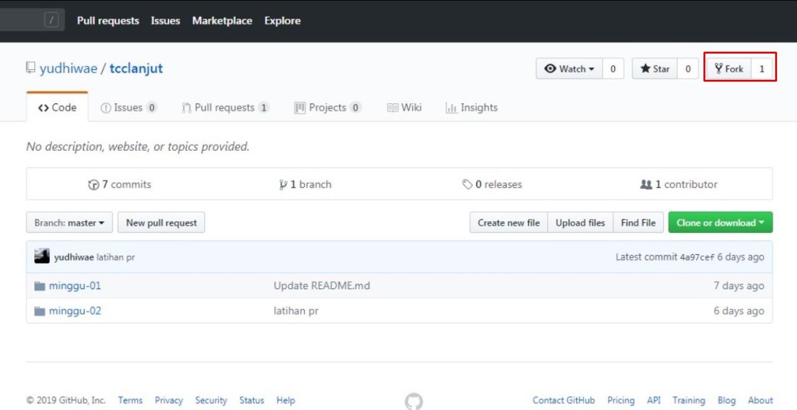

## Kolaborasi pada Git

#Fork

**Fork** adalah membuat clone dari suatu repo di GitHub milik upstream author **(pemilik repo)**, guna memproses clone ke komputer local kontributor.
Kontributor harus mem-fork repo upstream author (pemilik repo) sehingga di repo kontributor muncul repo tersebut

Ketika proses selesai, repo dari upstream author sudah berada di account GitHub kita sebagai (kontributor)

Setelah proses tersebut, clone di komputer lokal (kontributor):
Konfigurasikan repo lokal kontributor

#Mengirimkan Pull Request

Setiap kali melakukan perubahan, kirim perubahan tersebut. Pengiriman ini disebut dengan Pull Request.

* Kontributor akan bekerja di repo lokal (create, update, delete isi)
* Commit
* Push ke repo kontributor
* Kirimkan PR ke repo upstream author(pemilik repo).
* Upstream author me-review dan kemudian menyetujui (merge) ke master atau menolak PR.
  Jika disetujui dan di-merge oleh upstream author, akan ada tanda notifikas bahwa perubahan di setujui

Berikut ini adalah contoh pengiriman perubahan isi README.md dengan menambahkan kontributor.

Mencoba Kontribusi dan berkolaborasi github

