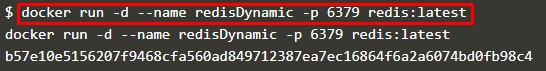

# Membuat Container

1. jalan perintah docker search redis untuk mencari image redis

 > menjalankan image redis yg baru saja di pull

2. Menampilkan container yang running

3. Menjalankan image redis dengan merubah / memindahkan pada port 6379

4. Membuat port dinamis pada image redis yang telah di akses

5. Maping direktori pada localhost 

6. Menjalankan Image ubuntu pada foreground

7. Menjalankan bash

[<<Back](README.md)