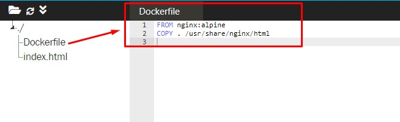
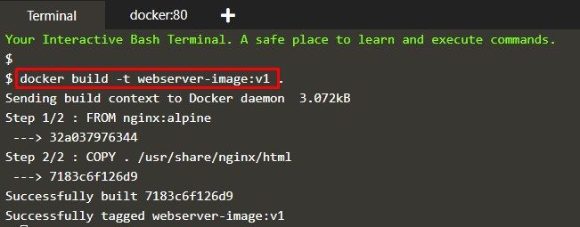
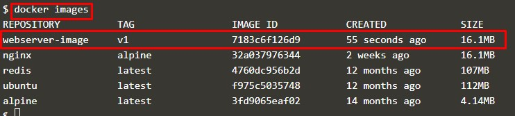
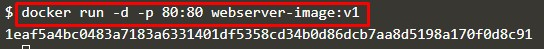
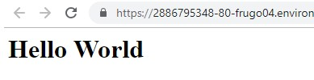

# Membangun Static Web dengan Container

1. Membuat Dockerfile

2. Build dockerfile menjadi Image

>menampilkan image yang baru saja di build

3. Running Image

4. Mengakses image melalui port 80

[<<Back](README.md)