# Build Container

1. Base Image dockerfile

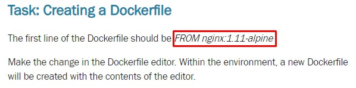

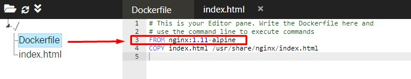

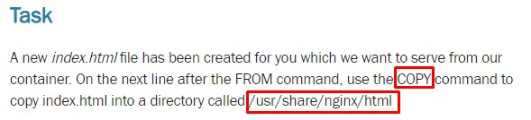

2. Configure Base Image

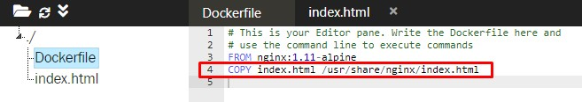

3. Expose Port

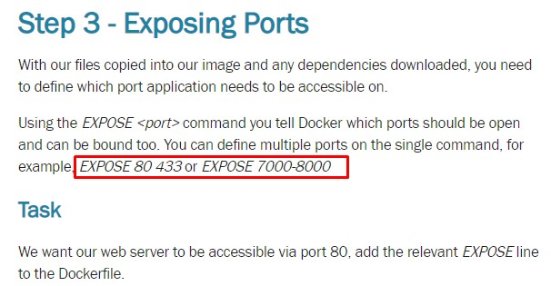

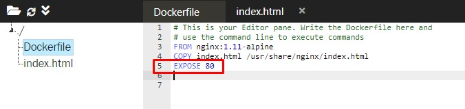

4. Command

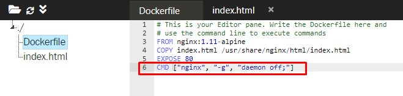

5. Build Container

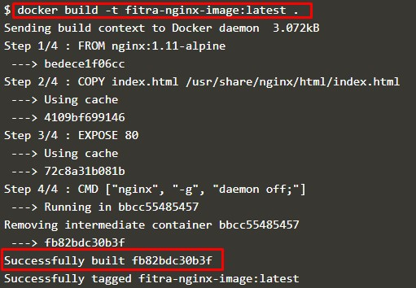

6. Running New Image

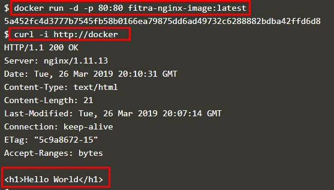

7. Output image baru

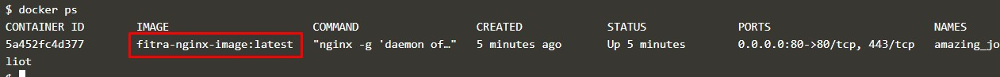

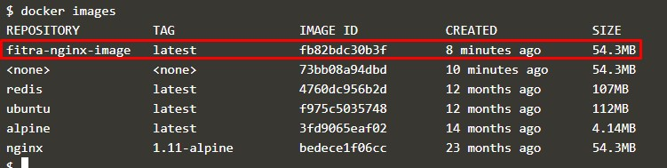

[<<Back](README.md)