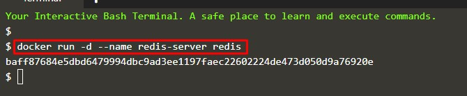
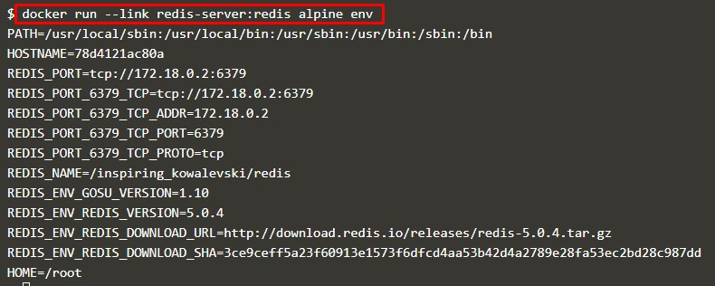
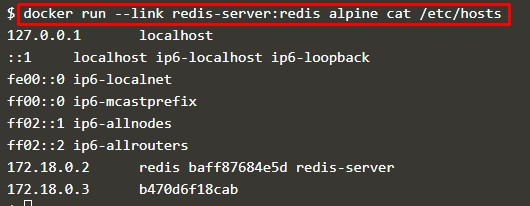

# Komunikasi Antar Container

**Langkah Pertama** - adalah membuat jaringan menggunakan CLI(command)

> Start Data Store

**Langkah Kedua** - adalah membuat jaringan menggunakan CLI(command)

> Cara kerja Link pada Docker
 
 

 

**Langkah Ketiga** - adalah membuat jaringan menggunakan CLI(command)

**Langkah Keempat** - adalah membuat jaringan menggunakan CLI(command)

**Langkah Kelima** - adalah membuat jaringan menggunakan CLI(command)

 [<<Back](README.md)