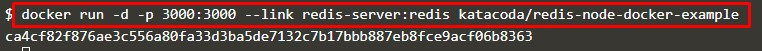

# Komunikasi Antar Container

**Langkah Pertama** - adalah membuat jaringan menggunakan CLI(command)

Skenario yang paling umum untuk menghubungkan ke container adalah aplikasi yang menghubungkan ke penyimpanan data. Aspek kunci saat membuat tautan adalah nama container. Semua kontainer memiliki nama, tetapi untuk membuatnya lebih mudah ketika bekerja dengan tautan, penting untuk menentukan nama yang ramah dari container sumber yang Anda sambungkan.

Jalankan server redis dengan nama redis-server yang akan kita sambungkan pada langkah berikutnya.

**Langkah Kedua** - Membuat Link

Untuk menghubungkan ke container sumber, Anda menggunakan opsi --link <container-name | id>: <alias> saat meluncurkan container baru. Nama kontainer merujuk ke sumber kontainer yang kami tentukan di langkah sebelumnya sementara alias mendefinisikan nama host.
 

**Langkah Ketiga** - Menghubungkan ke Applikasi

Dengan tautan yang dibuat, aplikasi dapat terhubung dan berkomunikasi dengan container sumber dengan cara biasa, terlepas dari kenyataan bahwa kedua layanan berjalan dalam container

**Langkah Keempat** - Menghubungkan Dengan Redis CLI

Dengan cara yang sama, Anda dapat menghubungkan wadah sumber ke aplikasi, Anda juga dapat menghubungkannya dengan alat CLI mereka sendiri.

 [<<Back](README.md)