# Jaringan Docker

**Langkah pertama** - adalah membuat jaringan menggunakan CLI(command). 
Jaringan ini akan memungkinkan untuk melampirkan banyak container yang akan dapat saling berhubungan.

Dalam contoh ini, kita akan mulai dengan membuat jaringan backend. Semua kontainer yang melekat pada backend akan berada di jaringan ini.
> Membuat jaringan
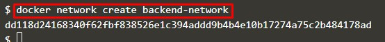

> Mengkoneksikan antar jaringan
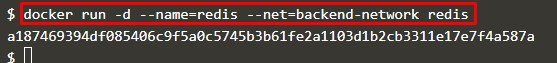

**Langkah kedua** - Komunikasi antar jaringan

Hal pertama yang perlu perhatikan adalah bahwa Docker tidak lagi menetapkan variabel dalam memperbarui file host dari container. 
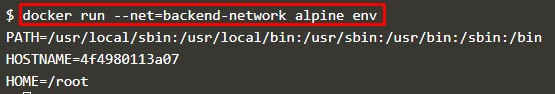

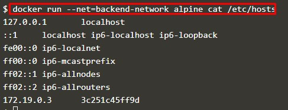

Container dapat berkomunikasi melalui Server DNS yang tertanam di Docker.
Server DNS ini ditugaskan untuk semua kontainer melalui IP 127.0.0.11 dan diatur dalam file resolv.conf.

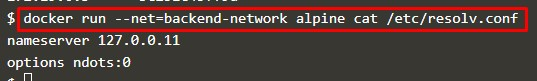

Ketika container mencoba mengakses container lain melalui nama yang yang dia kenal, seperti Redis, maka server DNS akan mengembalikan alamat IP container yang benar. 
Dalam hal ini, nama Redis yang sepenuhnya memenuhi syarat dalam redis.backend-network.

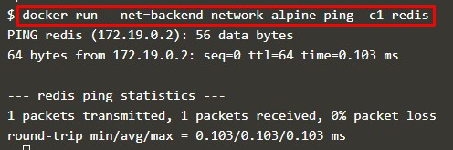

**Langkah ketiga** - Mengkoneksikan 2 Container

Docker mendukung beberapa jaringan dan container yang terhubung ke lebih dari satu jaringan sekaligus.
Sebagai contoh, mari kita buat jaringan terpisah dengan aplikasi Node.js yang berkomunikasi dengan instance Redis yang ada.

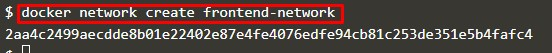

Ketika mencoba mengakses server web, maka pada jaringan yang sama itu, akan dapat berkomunikasi dengan instance Redis.

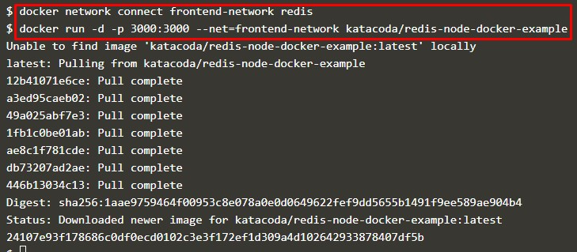

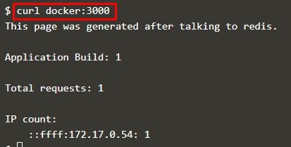

**Langkah Keempat** - Membuat alias

Menyediakan cara untuk mendefinisikan Alias ​​dengan nama container. 
Saat menggunakan --link, DNS yang disematkan akan menjamin hasil pencarian yang dilokalkan hanya pada container di mana --link digunakan.

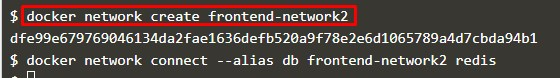

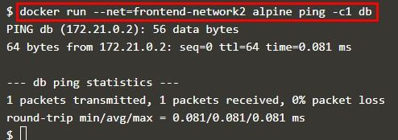

**Langkah Kelima** - Mengakhiri Container

Dengan membuat sebuah jaringan, kita dapat mengetahui secara detailnya.
Perintah berikut akan mencantumkan semua jaringan berada pada host 

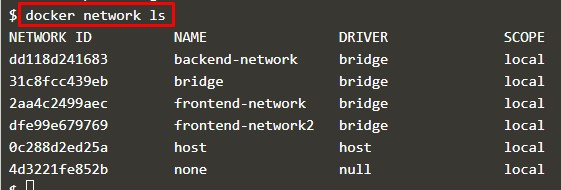

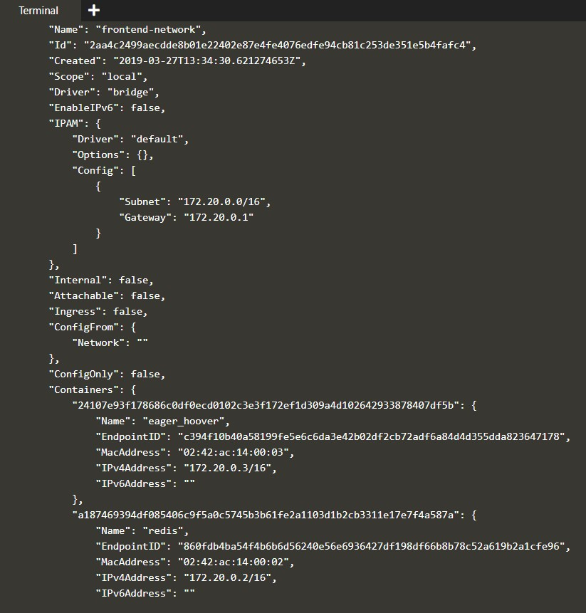

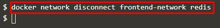

[<<Back](README.md)