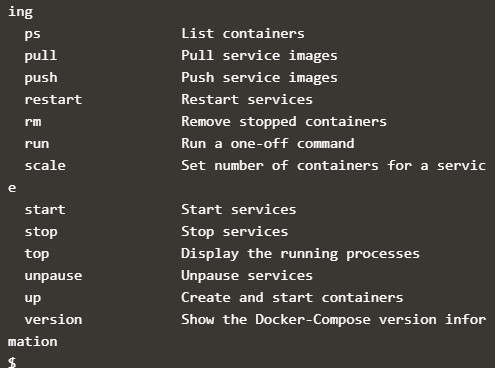

## Orchestration using Docker Compose

##### 1 -  Menentukan Kontainer Pertama

Docker Compose didasarkan pada file docker-compose.yml. File ini mendefinisikan semua kontainer dan pengaturan yang Anda butuhkan untuk meluncurkan kumpulan cluster Anda. Properti memetakan ke bagaimana Anda menggunakan perintah menjalankan buruh pelabuhan, bagaimanapun, sekarang disimpan dalam kontrol sumber dan dibagikan bersama dengan kode Anda.

Format file didasarkan pada YAML (Yet Another Markup Language).

 ```container_name:property: value- or options```

>Tugas: Menentukan Kontainer Pertama

Dalam skenario ini, kita memiliki aplikasi Node.js yang memerlukan koneksi ke Redis. Untuk memulai, kita perlu mendefinisikan file docker-compose.yml kita untuk meluncurkan aplikasi Node.js.

Dengan format di atas, file harus memberi nama kontainer 'web' dan mengatur properti build ke direktori saat ini. 

 ```web:build: .```

Ini akan mendefinisikan kontainer yang disebut web, yang didasarkan pada pembangunan direktori saat ini.


##### 2 - Menentukan Pengaturan

Docker Compose mendukung semua properti yang dapat didefinisikan menggunakan

 ```docker run```.

Untuk menghubungkan dua kontainer bersama untuk menentukan properti tautan dan mendaftar koneksi yang diperlukan. Misalnya, berikut ini akan menautkan ke sumber kontainer redis yang didefinisikan dalam file yang sama dan menetapkan nama yang sama ke alias.

```links:- redis```

Format yang sama digunakan untuk properti lain seperti port

```ports: - "3000"- "8000"```


>Tugas: Perbarui kontainer web  untuk mengekspos port 3001 dan buat tautan ke kontainer Redis.

#####  3 -  Mendefinisikan Kontainer Kedua

Pada langkah sebelumnya, Kita menggunakan Dockerfile di direktori saat ini sebagai dasar untuk kontainer Kita. Pada langkah ini, Kita ingin menggunakan gambar yang ada dari Docker Hub sebagai kontainer kedua.

Untuk menemukan kontainer kedua Anda cukup menggunakan format yang sama seperti sebelumnya pada baris baru. Format YAML cukup fleksibel untuk mendefinisikan banyak kontainer dalam file yang sama.

Tugas: Tentukan Kontainer Kedua

Tentukan kontainer kedua dengan nama redis yang menggunakan gambar redis. Mengikuti format YAML, detail kontainer adalah:

```redis:image: redis:alpinevolumes: - /var/redis/data:/data```


#####  4 -  Docker Up

Dengan file docker-compose.yml dibuat di tempat, Anda dapat meluncurkan semua aplikasi dengan satu perintah ```up```. Jika Anda ingin memunculkan satu kontainer, maka Anda dapat menggunakan ```up <nama>```.

Argumen -d menyatakan untuk menjalankan kontainer di latar belakang, mirip dengan saat digunakan dengan ```docker run```.

>Tugas: Luncurkan aplikasi Anda menggunakan 

```docker-compose up -d```


#####  5 -  Manajemen Docker

Docker Compose tidak hanya dapat mengelola kontainer awal tetapi juga menyediakan cara mengelola semua kontainer menggunakan satu perintah.

Misalnya, untuk melihat detail kontainer yang diluncurkan, Anda dapat menggunakan 

```docker-compose ps```.


Untuk mengakses semua log melalui satu aliran, Anda menggunakan 

```docker-compose logs```.


Perintah lain mengikuti pola yang sama. Temukan mereka dengan mengetik 

```docker-compose```.





#####  6 -  Docker Scale

Karena Docker Compose memahami cara meluncurkan kontainer aplikasi, itu juga dapat digunakan untuk mengukur jumlah kontainer yang berjalan.

Scale option memungkinkan Anda untuk menentukan layanan dan jumlah instance yang Anda inginkan. Jika angkanya lebih besar dari instans yang sudah berjalan, maka akan meluncurkan kontainer tambahan. Jika jumlahnya kurang, maka itu akan menghentikan kontainer yang tidak diminta.

>Tugas: Skala jumlah kontainer web yang Anda jalankan menggunakan perintah 

```docker-compose scale web = 3```


Anda dapat menurunkannya kembali menggunakan 

```docker-compose scale web = 1```


#####  7 -  Docker Stop

Seperti ketika kami meluncurkan aplikasi, untuk menghentikan satu set kontainer, Anda dapat menggunakan perintah 

```docker-compose stop```.


Untuk menghapus semua wadah gunakan perintah 

```docker-compose rm```.

