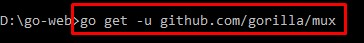
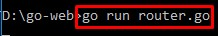
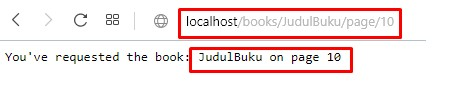

# Routing gorilla/mux


### Langkah-langkah :

1. Melakukan instalasi gorilla/mux dengan perintah "go get -u github.com/gorilla/mux"

    

2. Membuat file router.go 

    ```go

    package main

    import (
        "fmt"
        "net/http"

        "github.com/gorilla/mux" //mengimport package gorilla/mux dari github.com
    )

    func main() {
        r := mux.NewRouter() // membuat router r 
            // router menerima semua koneksi HTTP dan meneruskan parameter tersebut ke server didaftarkan
        r.HandleFunc("/books/{title}/page/{page}", func(w http.ResponseWriter, r *http.Request) {
            vars := mux.Vars(r)
            title := vars["title"]
            page := vars["page"]

            fmt.Fprintf(w, "Buku yang anda minta adalah : %s pada halaman %s\n", title, page)
        })

        http.ListenAndServe(":80", r)
    }

    ```
    HandleFunc adalah fungsi dari package net/http yang berguna untuk melakukan routing. 

    /books/{title}/page/{page} merupakan alamat routing dengan 2 paramater yang dapat ditentukan yaitu berupa {title} untuk judul buku dan {page} untuk halaman buku.

    fmt.Fprintf akan menampilkan respon yang berisi parameter title dan page tersebut.

3. Menjalankan router.go 

    

4. Mengakses halaman router.go dengan parameter title : JudulBuku dan page : 10

    