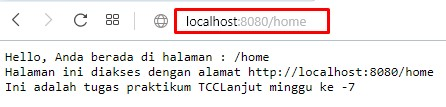

# Menampilkan Hello-world

1. Membuat file main.go yang berisi 2 buah halaman.

    ```go
    package main

    import (
        "fmt"
        "net/http" //melakukan import net/http package yang berisi semua fungsi dari protokol HTTP
    )

    func main() {
        http.HandleFunc("/", func(w http.ResponseWriter, r *http.Request) { //halaman utama
            fmt.Fprintf(w, "Hello, Anda berada di halaman : %s\n", r.URL.Path)
            fmt.Fprintf(w, "Halaman / adalah halaman utama, seperti halaman index pada php.\n")
            fmt.Fprintf(w, "Halaman ini diakses pada port 8080 atau http://localhost:8080")
        })
        http.HandleFunc("/home", func(w http.ResponseWriter, r *http.Request) { //halaman home
            fmt.Fprintf(w, "Hello, Anda berada di halaman : %s\n", r.URL.Path)
            fmt.Fprintf(w, "Halaman ini diakses dengan alamat http://localhost:8080/home\n")
            fmt.Fprintf(w, "Ini adalah tugas praktikum TCCLanjut minggu ke -7")

        })

        http.ListenAndServe(":8080", nil) //port yang digunakan untuk mengakses yaitu di http://localhost:8080
    }

    ```

    Fungsi fmt.Printf() digunakan untuk menampilkan output dalam bentuk tertentu.

    

2. Menjalankan file main.go melalui command prompt

    

3. Mengakses halaman utama dari alamat [http://localhost:8080](http://localhost:8080)

    

4. Mengakses halaman home dari alamat [http://localhost:8080/home](http://localhost:8080/home)

    