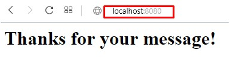

# Requests & Forms

1. Membuat file form.go

    ```go

    package main

    import (
        "html/template" 
        "net/http"
    )

    type ContactDetails struct {
        Email   string
        Subject string
        Message string
    }

    func main() {
        tmpl := template.Must(template.ParseFiles("form.html"))

        http.HandleFunc("/", func(w http.ResponseWriter, r *http.Request) {
            if r.Method != http.MethodPost {
                tmpl.Execute(w, nil)
                return
            }

            details := ContactDetails{
                Email:   r.FormValue("email"),
                Subject: r.FormValue("subject"),
                Message: r.FormValue("message"),
            }

            _ = details

            tmpl.Execute(w, struct{ Success bool }{true})
        })

        http.ListenAndServe(":8080", nil)
    }

    ```

  
    Bila terdapat request method berupa POST maka akan menjalankan fungsi tmpl.Execute sehingga parameter suksesnya bernilai true.

    File ini dapat di akses melakui port 8080.

2. membuat file form.html

    ```html

    {{if .Success}} 
	<h1>Thanks for your message!</h1>
    {{else}}
        <h1>Contact</h1>
        <form method="POST">
            <label>Email:</label><br />
            <input type="text" name="email"><br />
            <label>Subject:</label><br />
            <input type="text" name="subject"><br />
            <label>Message:</label><br />
            <textarea name="message"></textarea><br />
            <input type="submit">
        </form>
    {{end}}

    ```

    bila terjadi method post maka akan ditampilkan tulisan Thanks for your message!.

3. menjalankan file form.go

    

4. hasil Post

    