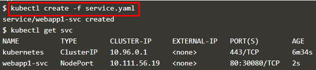

## Membangun Container menggunakan YAML

1. Create Deployment

   - Menambahkan definisi object deployment pada file deployment.yaml
        
    

    

   - kubectl create -f deployment.yaml : digunakan untuk mendeploy file deployment.yaml ke dalam cluster

   - kubectl get deployment : digunakan untuk menunjukkan list semua deployment object

   

   

   - kubectl describe deployment webapp1 : digunakan untuk menunjukkan detail dari deployment

2. Membuat Service

	Kubernetes memiliki kemampuan jaringan yang kuat yang mengontrol bagaimana cara aplikasi berkomunikasi. Konfigurasi jaringan ini juga dapat dikontrol melalui YAML.

	

	- Service membuat aplikasi tersedia melalui NodePort.

	

	- perintah tersebut digunakan untuk mendeploy file service.yaml

	

	- perintah ini digunakan untuk melihat deskripsi objek, sehingga didapatkan informasi lebih detail tentang konfigurasinya.

	

3. Mengukur Deployment

   Rincian dari YAML dapat diubah karena konfigurasi yang berbeda diperlukan dalam deployment.
   
   

   Pada file deployment.yaml nilai replicas diganti menjadi 4 untuk meningkatkan jumlah instance yang berjalan.

   

   - Perintah *kubectl apply* digunakan untuk menerapkan pembaruan definisi yang dilakukan.

   - Perintah *kubectl get deployment* digunakan untuk melihat status dari kluster yang telah diubah.

[<<back](README.md)