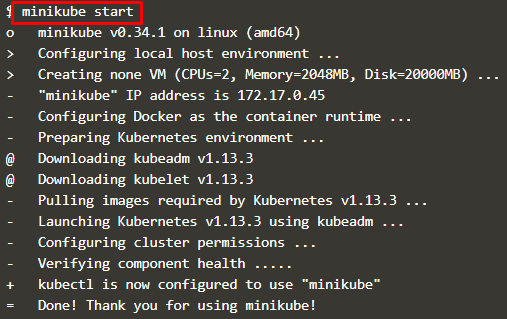
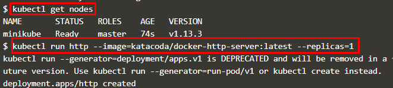
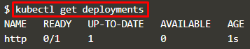
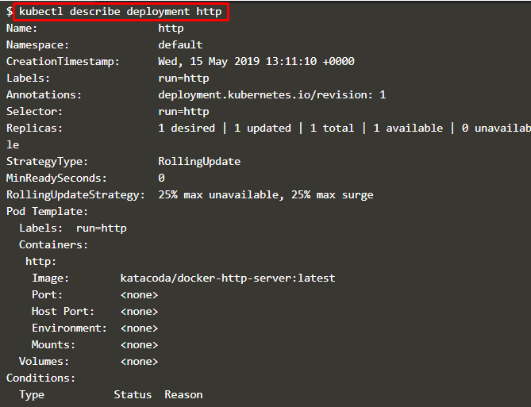
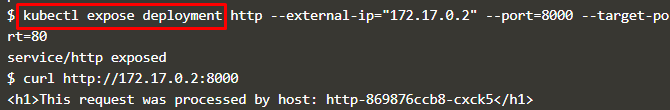
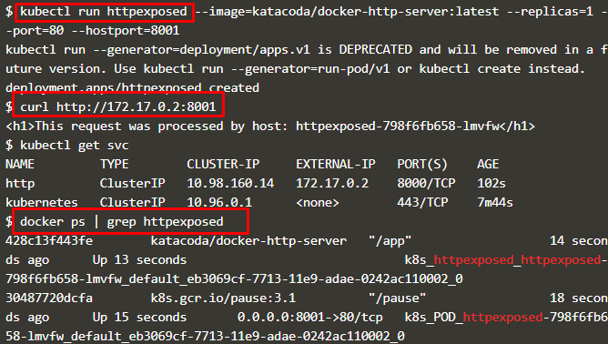
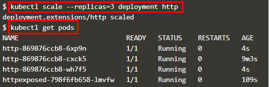
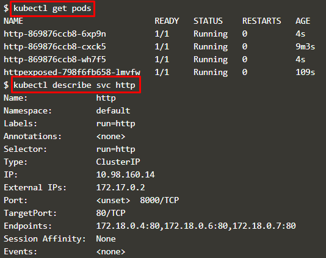

## Create Container Kubectl

Menggunakan Kubectl untuk membuat dan menjalankan Deployment, Kontrol Replikasi, dan mengeksposnya melalui Service tanpa menulis definisi yaml. Sehingga container dapat dijalankan dengan cepat ke dalam kluster.

1. Memulai Cluster

	minikube start : perintah untuk memulai minikube.
	
	

2. Menjalankan Kubectl

	Untuk menjalankan Kubectl, digunakan perintah RUN. Syntak perintahnya adalah 
	**kubectl run <name of deployment> <properties>**

	kubectl get nodes : digunakan untuk mengechek apakah node telah siap

	

	Untuk melihat status deploymentnya digunakan perintah : **kubectl get deployments**

	

	Dan untuk melihat apa saja yang telah dibuat oleh Kubernetes, proses deployment ini dapat dideskripsikan dengan perintah **kubectl describe deployment http**

	

	

3. Kubectl Expose

	Perintah kubectl expose digunakan untuk menentukan berbagai parameter layanan dan cara mengekspos penyebaran.

	

	- perintah ditas digunakan untuk mengekspos port kontainer 80 pada host 8000 yang mengikat ip eksternal host.

	- Perintah curl digunakan untuk melihat hasil dari service HTTP.

4. Kubectl Run dan Expose

	Dalam perintah kubectl run, bisa digunakan untuk membuat deployment dan mengeksposenya dengan satu perintah saja.

	

	- Perintah pertama dimaksudkan untuk membuat service kedua dan mengeksposenya pada port 8001.

	- Perintah *kubectl get svc* digunakan untuk melihat service yang terdaftar.

	- Perintah *docker ps | grep httpexposed* digunakan untuk melihat detail dari service. 

5. Skala Container

	Pengukuran jumlah replika dari deploymen ini akan meminta Kubernetes untuk meluncurkan Pod tambahan. Pod ini kemudian akan secara otomatis dimuat seimbang menggunakan service yang terbuka.

	

	- Perintah *kubectl scale* digunakan untuk menyesuaikan jumlah Pods yang berjalan pada deployment atau replikasi tertentu.

	- Perintah *kubectl get pods* digunakan untuk melihat list dari semua pod yang berjalan.

	

[<<back](README.md)